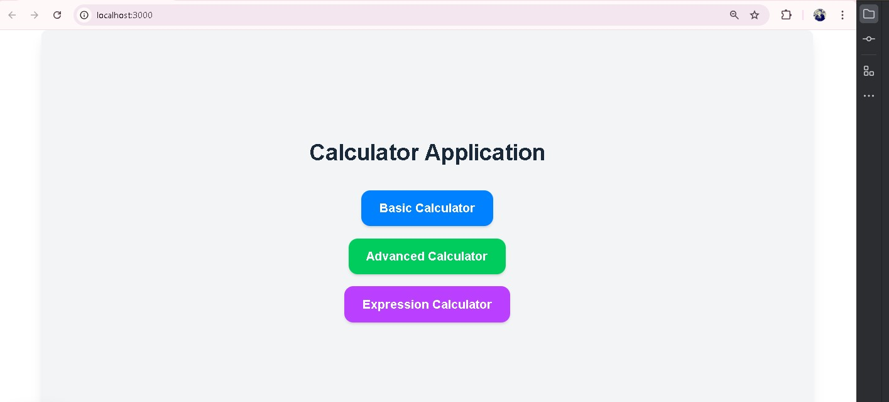
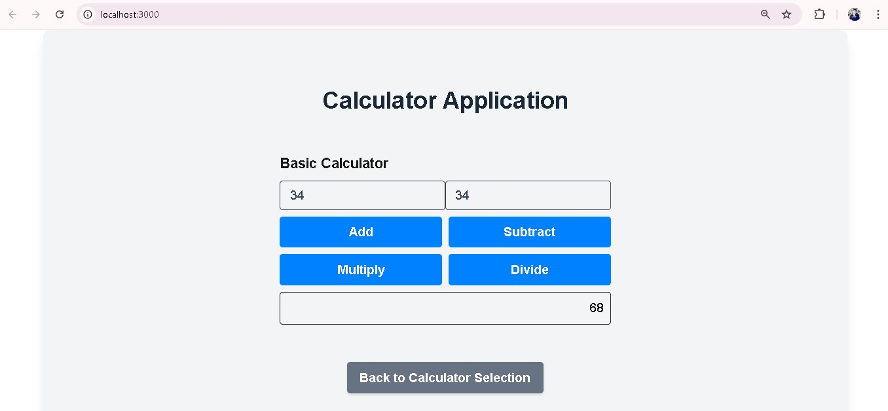
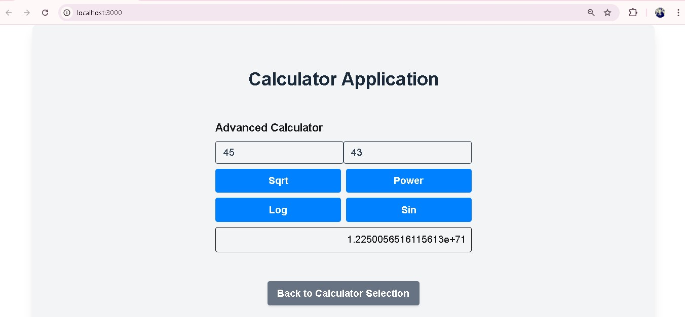
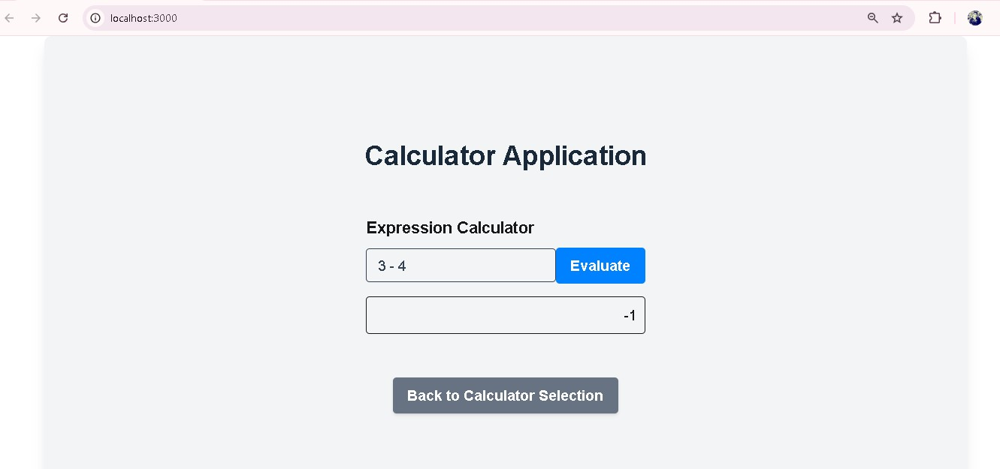

# Calculator Pro

A full-stack calculator application with **three modes**:

1. **Basic**: Simple arithmetic operations (`+`, `-`, `*`, `/`).
2. **Advanced**: Advanced calculations (can include operations like exponentiation, trigonometry, etc.).
3. **Expression**: Evaluate mathematical expressions with parentheses, operator precedence, etc.

This project is built with:

- **Backend:** Java Spring Boot
- **Frontend:** Next.js, React, TypeScript

---

## Features

- Supports **Basic, Advanced, and Expression** calculation modes.
- Real-time evaluation of mathematical expressions.
- Proper error handling for invalid expressions.
- REST API endpoints for each mode.

---

## API Endpoints

### Basic Calculator


---

## Screenshots

You can add screenshots to the README by placing images in your repository and referencing them like this:








## Repository Links

- **Frontend:** [Frontend Repository](https://github.com/miladrostami-devjava/Calculator-Application-Fullstack-frontend-Repository-)
- **Backend:** [Backend Repository](https://github.com/miladrostami-devjava/Calculator-Application-Fullstack-Backend-Repository)


git clone <BACKEND_REPOSITORY_LINK>
https://github.com/miladrostami-devjava/Calculator-Application-Fullstack-Backend-Repository-.git

cd backend
./mvnw spring-boot:run


git clone <FRONTEND_REPOSITORY_LINK>
https://github.com/miladrostami-devjava/Calculator-Application-Fullstack-frontend-Repository-.git

cd frontend
npm install
npm run dev


Backend runs on: http://localhost:1383

Frontend runs on: http://localhost:3000


### Error Handling
Invalid expressions return an error response with details:

{
"error": "Invalid expression"
}


This is a [Next.js](https://nextjs.org) project bootstrapped with [`create-next-app`](https://nextjs.org/docs/app/api-reference/cli/create-next-app).

## Getting Started

First, run the development server:

```bash
npm run dev
# or
yarn dev
# or
pnpm dev
# or
bun dev
```

